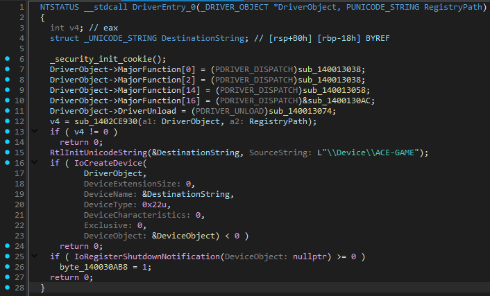
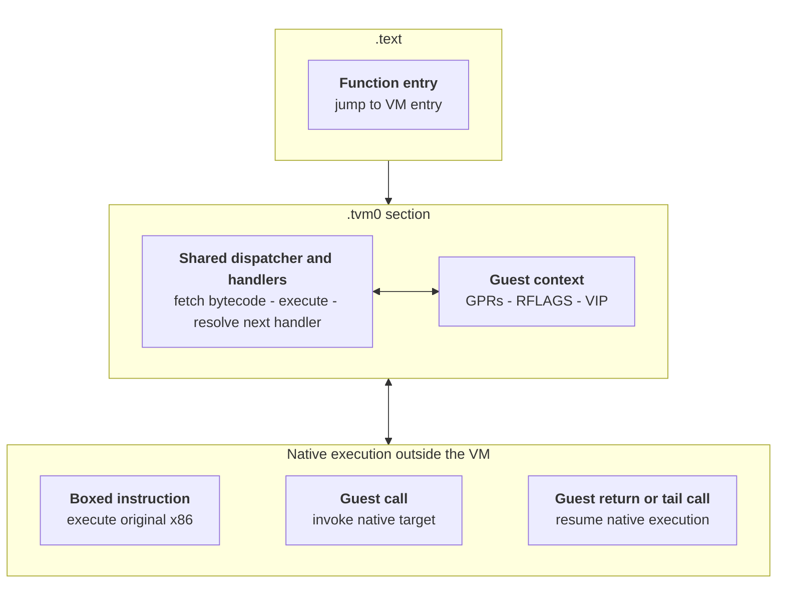

# tvm-devirt

A static devirtualizer targeting Tencent VM (TVM). Recovers virtualized control flow & attempts to lower guest behavior back to native x86.

Devirtualized DriverEntry of ACE-GAME.sys.



## Build

```bash
cargo build --release
cargo test
```

## Usage

List virtualized entry points:

```bash
tvm-devirt entries input.exe --all
```

Inspect one function:

```bash
tvm-devirt cfg input.exe 0x140001000
tvm-devirt ssa input.exe 0x140001000
tvm-devirt lower input.exe 0x140001000
tvm-devirt devirt input.exe 0x140001000 --output function.bin
```

Devirtualize all recoverable functions, devirtualized code is appended at the end of .tvm0 section:

```bash
tvm-devirt write-devirt input.exe output.exe
```

Run `tvm-devirt --help` or `tvm-devirt <command> --help` for all options.

## TVM Overview

TVM replaces a native function with a trampoline into a VM dispatcher. The dispatcher executes native x86 handlers, but the protected function's architectural state lives in the VM context.



Some operations execute outside the VM. A **boxed instruction** runs its original x86 encoding after the VM restores the registers it needs, then returns its effects to the guest context. A **guest call** invokes a native target and resumes with the return value and Windows x64 ABI clobbers represented in guest state. Guest returns and tail calls leave the dispatcher entirely.

The context contains all sixteen guest general-purpose registers, including the guest `RSP`, plus packed guest flags. The exact context layout can vary, so the lifter identifies the guest register image by observing the VM's register save and restore behavior rather than assuming a single fixed address.

Conditional control flow is implemented through dispatch arithmetic. A handler extracts a guest flag or predicate, uses it to select the next virtual program counter, and computes the address of the next native handler. The devirtualizer symbolically evaluates that process and forks the evaluator when the selected path depends on an unresolved guest value.

## Project Layout

```text
src/binary/   PE parsing, disassembly, format constants
src/vm/       VM entry discovery, state, and CFG exploration
src/ir/       symbolic expressions, hashing, lifting, scheduling, and allocation
src/codegen/  x86 emission, control flow, operands, frame layout, and unwind data
src/cli/      inspection, recovery, formatting, and writeback commands
```

## Limitations

- Codegen quality is far from perfect and the output binaries are meant for analysis only.
- Unsupported or unresolved VM behavior can leave a function incomplete.

## Credits

- [k0mkc](https://k0mkc.hatenablog.com/archive/category/AntiCheatExpert)
- [Back Engineering Labs](https://back.engineering/blog/31/07/2026/)
